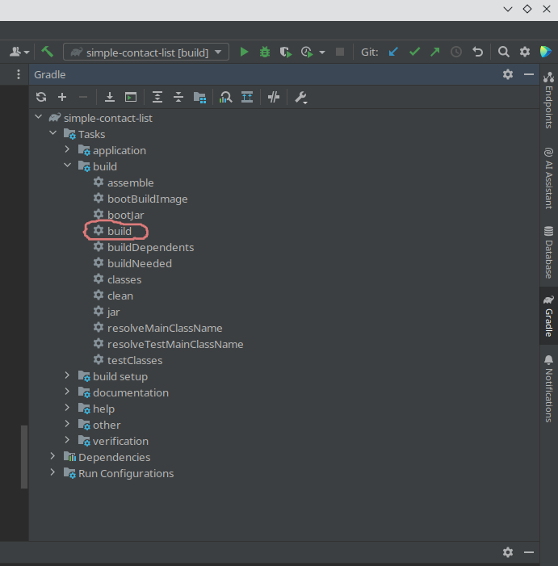

## Практическая работа №3
# Курса «Разработка на Spring Framework» от компании Skillbox.«Простой список контактов»

Программа демонстрирует основные возможности Spring MVC и Spring Data JDBC. Работа с базой данной в приложение используется JdbcTemplate.
Сознан простейший web-интерфейс пользователя при помощи шаблонизатора Thymeleaf.  

Приложение умеет выводить все контакты в таблице, добавлять, удалять и редактировать контакт.
Столбцы таблицы состоят из полей сущности контакт, это: индикационный номер, имя, фамилия, телефон, email.

## Описание Web-интерфейса

Интерфейс представляет web-страницу.


При нажатие на ссылку __Create Contact__ Выполняется GET-запрос (http://localhost:8085/contact/create) на открытие формы добавления контакта. 
Все поля обязательные, Id контакта генерируется автоматически. 
При нажатие __Save__ происходит отправка данных контакта в POST-запросе (http://localhost:8085/contact/action?create) на добавление его в список


Возле каждого контакта находятся две ссылки __Edit__ и __Delete__. При нажатие __Edit__ откроется форма по GET-запросу (http://localhost:8085/contact/edit/{id}), аналогичная созданию контакта.
При нажатие __Save__, будет выполнен POST-запрос (http://localhost:8085/contact/action?edit).


При нажатите __Delete__, контакт будет удален из базы данных по GET-запросу (http://localhost:8085/contact/delete/{id})

## Настройки окружения приложения 
Если в файле конфигурации __application.yml__ указан такой параметр, как __environment.create__, то после запуска генерируется случайные контакты, при помощи библиотеки Faker 

````
server:
  port: ${SERVER_PORT:8080}
spring:
  datasource:
    url: ${SPRING_DATASOURCE_URL:jdbc:postgresql://localhost:5432/contacts}
    username: postgres
    password: postgres
    hikari:
      schema: contacts_schema
environment:
  create: ${CREATE_CONTACTS:2}
````

## Компиляция:
Приложение собирается при использовании автоматического сборщика пакетов Gradle. Скомпилированный файл приложения можно получить, воспользовавшись инструментами среды разработки IntelIj Idea 



или набрав команду в консоли, предварительно перейдя в корневую директорию проекта.
````shell
~/simple-contact-list$ gradle build
````
Jar-файл приложения находятся в папке ~/simple-contact-list/build/libs

## Использования Докера, запуск:

Для запуска приложения используется docker-compose. Но до этого надо сгенерировать образ программы.
Для того выполним команду в терминале находясь в папке приложения:

````shell
~/simple-contact-list$ docker build -t list-contact .
````
Сбилдится образ согласно настройкам в dockerfile

````
FROM openjdk:17-oracle
ENV HOME=/app
WORKDIR $HOME
COPY build/libs/simple-contact-list-0.0.1-SNAPSHOT.jar app.jar
CMD ["java", "-jar", "app.jar"]
````

Затем перейдём в директорию /docker и запустим docker-compose

````shell
~/simple-contact-list/docker$ docker-compose up
````
Запуск сконфигурирован в файле __docker-compose.yml__

````
version: '3'

services:
  client-backend:
    image: list-contact:latest
    ports:
      - "8085:8085"
    depends_on:
      - postgres
    environment:
      - SERVER_PORT=8085
      - SPRING_DATASOURCE_URL=jdbc:postgresql://postgres/contacts
      - CREATE_CONTACTS=2
  postgres:
    image: postgres:16
    ports:
      - "5432:5432"
    environment:
      - POSTGRES_USER=postgres
      - POSTGRES_PASSWORD=postgres
      - POSTGRES_DB=contacts
    volumes:
      - ./init.sql:/docker-entrypoint-initdb.d/init.sql
      - db_data:/var/lib/postgresql/data
    restart: unless-stopped

volumes:
  db_data:
````
Докер запуска два образа, это образ данного приложения list-contact и образ базы данных PostgresSql.
Запуск образа приложения зависит от запуска образа базы.
Для настроек запуска образа приложения имеются несколько переменных окружения среды.
```
 - SERVER_PORT=8085
```
SERVER_PORT - порт по которому будет доступно приложение в браузере(http://localhost:8085)
````
- SPRING_DATASOURCE_URL=jdbc:postgresql://postgres/contacts
````
SPRING_DATASOURCE_URL - адрес по которому будет доступна наша база данных, localhost:5432 заменяется названием контейнера образа базы данных.
 ```
 - CREATE_CONTACTS=2
 ```
CREATE_CONTACTS - число создаваемых случайных контактов.

После старта базы данных, инициализируется стартовый скрипт __init.sql__, который содержит структуру базы данных. 
```
volumes:
      - ./init.sql:/docker-entrypoint-initdb.d/init.sql
```

## Системные требования:
• Java 17
• Gradle
• Docker 24.0.2