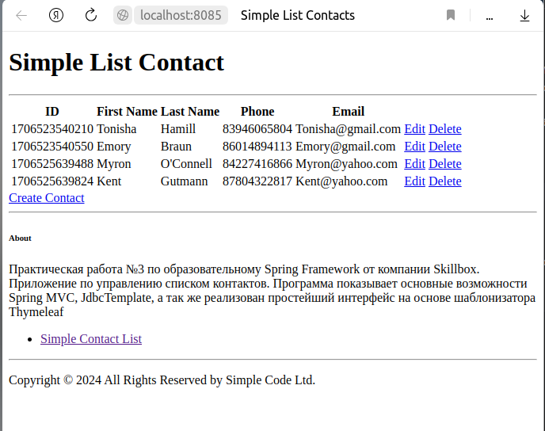
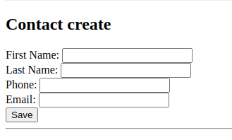
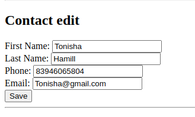

## Практическая работа №3
# Курса «Разработка на Spring Framework» от компании Skillbox.«Простой список контактов»

Программа демонстрирует основные возможности Spring MVC и Spring Data JDBC. Работа с базой данной в приложение используется JdbcTemplate.
Сознан простейший web-интерфейс пользователя при помощи шаблонизатора Thymeleaf.  

Приложение умеет выводить все контакты в таблице, добавлять, удалять и редактировать контакт.
Столбцы таблицы состоят из полей сущности контакт, это: индикационный номер, имя, фамилия, телефон, email.

## Описание Web-интерфейса

Интерфейс представляет web-страницу.

При нажатие на ссылку __Create Contact__ или __Edit__, будет отображаться форма редактирования или создания контакта, они идентичны.

или

## Компиляция и запуск:
Приложение собирается при использовании автоматического сборщика пакетов Apache Maven. Скомпилированный файл приложения можно получить, воспользовавшись инструментами среды разработки IntelIj Idea или набрав команду в консоли, предварительно перейдя в корневую директорию проекта.

## Использования Докера:

## Системные требования:
• Java 17
• Maven 3.8 или выше
• Docker 24.0.2